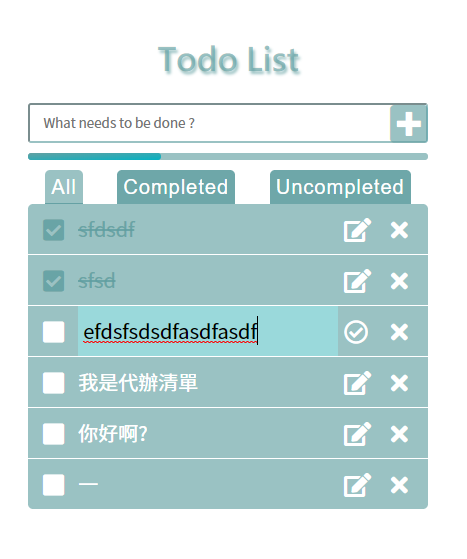

# TodoList in React 

## [Demo](https://lagom0327.github.io/TodoList-React/)
### Introduction
使用自建的 React 環境，將 TodoList 資料存在 `Local Storage`，關閉視窗後再次打開網頁能看到上次的資料
### Screenshot 

## File Structure
```
.
├── dist
│   ├── index.html
│   └── bundle.[hash].js
├── src
│   ├── components
│   │   ├── App.js
│   │   ├── Filters.js
│   │   ├── TotoInput.js
│   │   ├── TotoItem.js
│   │   └── TodoItems.js
│   ├── css
│   │   ├── reset.css
│   │   └── style.css
│   ├── index.html
│   └── index.js
├── .babelrc
├── .eslintrc.js
├── .gitignore
├── package.json
├── package-lock.json
├── README.md
├── todolist.png
└── webpack.config.js
```

### User Manual
- 新增 : 在上方 `input` 輸入文字後按右方按鈕或 `enter` 可新增 Todo item
- 更改 Item 內容 : 點擊右方編輯按鈕後油標會自動 focus 到 `input` 裡
  - 取消更改 : 點擊 `input` 外區域(不包含確定、刪除按鈕)
  - 確定更改 : 點擊確定按鈕 
- 更改 Item 狀態 : 點擊 Item 文字或左邊白色方框
- 刪除 : 點擊刪除按鈕
- 有三種 Tab 可選，可過濾 Item 狀態(全部、已完成、未完成)


## Getting Started
cloning the repository
```console
git clone https://github.com/lagom0327/TodoList-React.git
```
Installing all dependencies for the project:
```console
npm install
```
Starting a server instance, listening on port 8080:
```console
npm run start
```

## Deploying to GitHub Pages
Add remote repository
```console
git remote add origin git@github.com:User/UserRepo.git
```
Build & Deploy the application
```console
npm run deploy
```

## Built With
- [React](https://reactjs.org/) 
- [Webpack](https://webpack.js.org/) : Bundle the scripts
- [ESLint](https://eslint.org/) : Lint Code
- [GitHub Pages](https://pages.github.com/) : Deploy